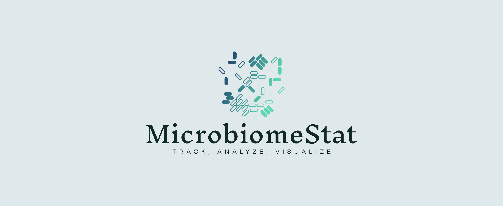

# Track, Analyze, Visualize: Unravel Your Microbiome's Temporal Tale with MicrobiomeStat.

## **MicrobiomeStat: Bridging Time and Data in Microbiome Analysis**

<figure><figcaption></figcaption></figure>

**MicrobiomeStat** isn't just another package, it's a **specialized tool** for microbiome analysis. Designed with a focus on **longitudinal studies**, it provides comprehensive solutions for both **longitudinal** and **paired analyses**. And that's not all; **MicrobiomeStat** is also versatile enough for **cross-sectional studies**.

Interestingly, **MicrobiomeStat** isn't limited to microbiome data. Have **multi-omics data**? **MicrobiomeStat** is ready to assist! Our goal is to establish **MicrobiomeStat** as a **helpful R package** for **longitudinal analysis of multi-omics data**.

Before diving further, we would like to extend our heartfelt appreciation to the developers of the packages that **MicrobiomeStat** depends on. Our work is built upon the robust foundations laid by packages such as `rlang`, `tibble`, `ggplot2`, `matrixStats`, `parallel`, `ggrepel`, `lmerTest`, `foreach`, `modeest`, `vegan`, `dplyr`, `pheatmap`, `tidyr`, `ggh4x`, `ape`, `GUniFrac`, `scales`, `stringr`, `broom`, and others. Their diligent work has greatly facilitated the development of **MicrobiomeStat**.

We also acknowledge and pay homage to the pioneering work done by the developers of **microbiomeutilities**, **phyloseq**, **microbiomemarker**, **MicrobiomeAnalyst**, **microbiomeeco**, **EasyAmplicon**, **STAMP**, **qiime2**, **MicrobiotaProcess**, **q2-longitudinal**, **SplinectomeR**, and **coda4microbiome**. Their contributions have significantly advanced the field and inspired us in creating **MicrobiomeStat**.
