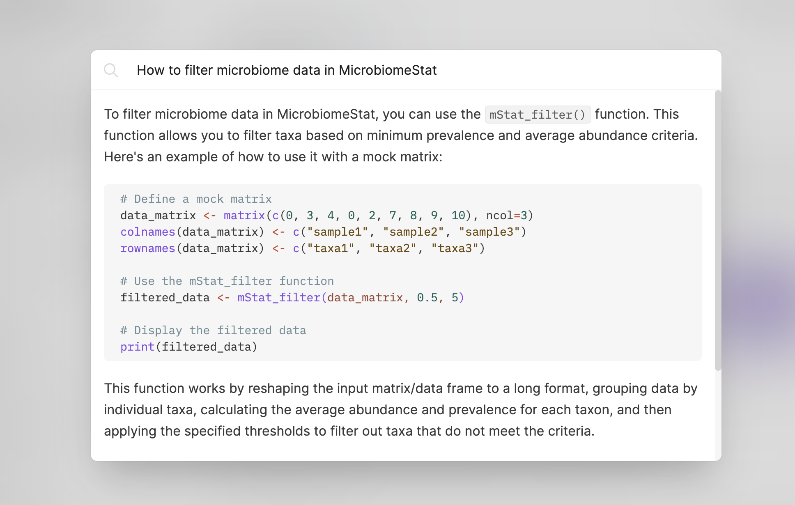

# Track, Analyze, Visualize: Unravel Your Microbiome's Temporal Pattern with MicrobiomeStat.

## **MicrobiomeStat:** Supporting Longitudinal Microbiome Analysis in R

<figure><figcaption></figcaption></figure>

MicrobiomeStat is a specialized tool for analyzing longitudinal and paired microbiome data. It can also be used for longitudinal analysis of other omics datatypes as long as the data are properly normalized and transformed. As a special case, cross-sectional and case-control microbiome data analysis is also supported.

## Gitbook LLM Integration

Maximize the potential of MicrobiomeStat by utilizing its Gitbook wiki documentation in conjunction with Gitbook LLM (Large Language Model). In the top right corner of the Gitbook, you'll find the "Ask or Search" feature. Feel free to pose any questions you might have, such as "How to filter microbiome data in MicrobiomeStat?"

The Gitbook LLM, fine-tuned specifically for the MicrobiomeStat wiki, will provide you with the answers you need. For example:

<figure><figcaption>Example of Gitbook LLM providing an answer to a question</figcaption></figure>

By leveraging this feature, you can quickly find solutions and guidance for using MicrobiomeStat effectively in your research.

## Dependencies

It depends on packages such as `rlang`, `tibble`, `ggplot2`, `matrixStats`, `lmerTest`, `foreach`, `modeest`, `vegan`, `dplyr`, `pheatmap`, `tidyr`, `ggh4x`, `ape`, `GUniFrac`, `scales`, `stringr`, `rmarkdown`, `knitr`, `pander`, and `tinytex`. We thank the authors of these packages, whose work has greatly facilitated the development of MicrobiomeStat.

We also acknowledge the work by the developers of `microbiomeutilities`, `phyloseq`, `microbiomemarker`, `MicrobiomeAnalyst`, `microeco`, `EasyAmplicon`, `STAMP`, `qiime2`, `MicrobiotaProcess`, `q2-longitudinal`, `SplinectomeR`, and `coda4microbiome`. Their contributions have significantly advanced the field and inspired us in creating MicrobiomeStat.

## News

### January 8th, 2024

Exciting news for our users! We have enhanced the color palette functionality in our package. You can now use predefined palette names like "lancet", "nejm", "npg", "aaas", "jama", "jco", and "ucscgb" directly in the `palette` parameter across most functions. This update simplifies the process of customizing color schemes in your data visualizations, making your plots more visually appealing and easier to interpret. For more details, please refer to the function documentation.

### October 20th, 2023

We are pleased to announce that the Shiny interface for `MicrobiomeStat` is now officially available. This interface provides an interactive platform for microbiome data analysis, making it more accessible and user-friendly. The Shiny application can be accessed directly at [this link](https://microbiomestat.shinyapps.io/MicrobiomeStat-Shiny/). For users who prefer a local setup or require more customization, the Shiny application files and instructions are available on its dedicated [GitHub repository](https://github.com/cafferychen777/MicrobiomeStat-Shiny).

Stay tuned for more updates and enhancements as we continue to improve `MicrobiomeStat` for our user community.

## Contribute to MicrobiomeStat and Its Wiki

We welcome contributions to both the MicrobiomeStat project and its Wiki. Here's a guide on how to contribute using GitHub Desktop:

1. Download and install [GitHub Desktop](https://desktop.github.com/).

2. Visit the  [MicrobiomeStat repository](https://github.com/cafferychen777/MicrobiomeStat) and [MicrobiomeStat Wiki repository](https://github.com/cafferychen777/MicrobiomeStat-Wiki) on GitHub.

3. Click the "Fork" button in the top-right corner to create a copy of the repository in your account.

4. Open GitHub Desktop and select "File" > "Clone Repository". Choose the repository you just forked and clone it to your local machine.

5. Make your desired changes or additions to the Wiki content locally.

6. In GitHub Desktop, you'll see the modified files. Add a brief commit message and click "Commit to main".

7. Click "Push origin" at the top to push your changes to your GitHub repository.

8. Return to the GitHub website and navigate to your repository. You'll see a "Contribute" button - click it and select "Open pull request".

9. Fill in the pull request description and submit it.

Our team will review your pull request and merge the changes once approved. By contributing to the Wiki, you'll be helping to improve the documentation and resources available to the MicrobiomeStat user community. We appreciate your support in making this project better for everyone!

If you encounter any issues during this process, please feel free to open an issue on GitHub for assistance.

## Resources

- MicrobiomeStat Repository: [GitHub](https://github.com/cafferychen777/MicrobiomeStat)
- MicrobiomeStat Shiny Repository: [GitHub](https://github.com/cafferychen777/MicrobiomeStat-Shiny)
- Shiny Web Application: [Link](https://microbiomestat.shinyapps.io/MicrobiomeStat-Shiny/)
- MicrobiomeStat Github Pages: [Link](https://cafferychen777.github.io/MicrobiomeStat/index.html)
- Function Documentation: [Link](https://cafferychen777.github.io/MicrobiomeStat/reference/index.html)
- Gitbook Wiki: [Link](https://www.microbiomestat.wiki/)

## Contributors

We would like to express our gratitude to the following contributors for their valuable contributions to the MicrobiomeStat project:

<table>
  <tr>
    <td style="width: 10px; height: 10px;"></td>
    <td style="width: 10px; height: 10px;"></td>
    <td style="width: 10px; height: 10px;"></td>
    <td style="width: 10px; height: 10px;"></td>
    <td style="width: 10px; height: 10px;"></td>
  </tr>
</table>

