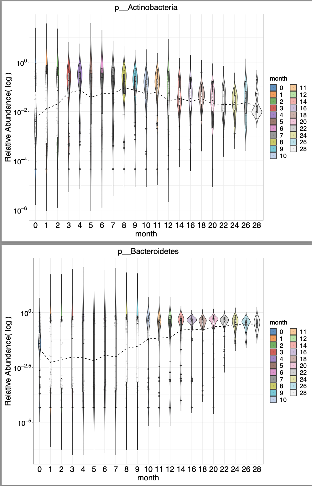

# Taxonomic Timelines: Feature-level Analysis in Longitudinal Studies

This guide will walk you through the process of investigating how taxonomic composition changes within a longitudinal context, providing insights into microbial dynamics over time.

MicrobiomeStat provides a set of functions to illuminate the intricate taxonomic changes over time. The `generate_taxa_trend_test_long()` function executes a trend test on longitudinal microbiome data. It commences with the normalization of count data, followed by the generation of a mixed-effects model that incorporates time, group, and subject variables. Special attention is given to the interaction between time and group variables. Finally, the function applies the `linda()` method to discern whether these variables significantly influence taxa abundance.

The `feature.dat.type` parameter plays a crucial role in the data preprocessing phase:

* `"count"`: For raw count data, the function first performs sparsity treatment, followed by a Total Sum Scaling (TSS) normalization. This process ensures that the data is suitably normalized and comparable across samples.
* `"proportion"`: Data presented as proportions remains unaltered.However, it's worth noting that during the LinDA differential abundance analysis, zeroes in the dataset are substituted with half of the smallest non-zero count for each feature. This adjustment is done to mitigate the impact of zero-inflation.
* `"other"`: In scenarios where the data originates from non-microbiome sources, like single-cell studies, spatial transcriptomics, KEGG pathways, or gene data, a different data transformation approach might be more apt. When `feature.dat.type` is set to `"other"`, the function refrains from any normalization or scaling operations, allowing users to apply domain-specific transformations if necessary.

Further enhancing data robustness, the `prev.filter` and `abund.filter` parameters filter taxa based on prevalence and average abundance, respectively. Specifically:

* `prev.filter` targets taxa retention based on their prevalence across samples.
* `abund.filter` focuses on the average abundance of taxa across all samples.

Such filtering ensures that the analysis centers on taxa both prevalent and abundant, enhancing result reliability by excluding potential outliers or noise.

For those directly analyzing entities like OTU, ASV, Gene, KEGG, etc., that don't require aggregation, it's recommended to set the `feature.level` parameter to `"original"`.

Furthermore, when interpreting the results, it's essential to understand the role of `feature.sig.level` and `feature.mt.method` parameters:

* `feature.sig.level`: This parameter determines the significance level, primarily influencing the position of the dashed lines in the volcano plot. It sets the threshold for distinguishing between significant and non-significant differences in taxa abundance.
* `feature.mt.method`: There are two options available for this parameter: `"fdr"` (False Discovery Rate) and `"none"`. Regardless of how this parameter is set, it's crucial to note that the test function always performs adjustments post-testing. However, the `feature.mt.method` specifically influences the visualization in the volcano plot, guiding how p-values are adjusted in that context.

Another important parameter is `feature.change.func`, which specifies the method or function used to compute the change between two time points. The options include:

* `"absolute change"` (default): Computes the absolute difference between the values at the two time points (`value_time_2` and `value_time_1`).
* `"log fold change"`: Computes the log2 fold change between the two time points. For zero values, imputation is performed using half of the minimum nonzero value for each feature level at the respective time point before taking the logarithm.
* `"relative change"`: Computes the relative change as `(value_time_2 - value_time_1) / (value_time_2 + value_time_1)`. If both time points have a value of 0, the change is defined as 0.
* A custom function: If a user-defined function is provided, it should take two numeric vectors as input corresponding to the values at the two time points (`value_time_1` and `value_time_2`) and return a numeric vector of the computed change. This custom function will be applied directly to calculate the difference.

By understanding and appropriately setting these parameters, users can ensure a more accurate and contextually relevant interpretation of the plotted results.

```R
data("subset_T2D.obj")
generate_taxa_trend_test_long(
  data.obj = subset_T2D.obj,
  subject.var = "subject_id",
  time.var = "visit_number_num",
  group.var = "subject_race",
  adj.vars = "sample_body_site",
  prev.filter = 0.1,
  abund.filter = 0.001,
  feature.level = c("Genus","Family"),
  feature.dat.type = c("count")
)
```

The function `generate_taxa_volatility_test_long()` is designed to analyze longitudinal microbiome data by calculating the volatility of taxa abundances and testing for an association with a grouping variable. Prior to the calculation of volatility, a centered log-ratio (CLR) transformation is performed on the data.

After the transformation, the volatility, $V$, is computed as the mean rate of change in abundance over time, defined as:

$$
V = \frac{1}{n} \sum_{i=1}^{n} \left| \frac{A(t_{i+1}) - A(t_i)}{t_{i+1} - t_i} \right|
$$

where $A(t)$ is the abundance at time $t$ and $Δt = t_{i+1} - t_i$ is the time difference.

This function fits a linear model to the volatility data with the formula $V = β_0 + β_1*G + β_2*X + ε$, where $V$ is the volatility, $G$ is the group variable, $X$ represents adjustment variables, and $ε$ is the error term. If the group variable is multi-categorical, an ANOVA test is also performed to test the overall significance of the group variable, while considering the adjustment variables.

The function is applied as follows:

```R
data("subset_T2D.obj")
generate_taxa_volatility_test_long(
  data.obj = subset_T2D.obj,
  time.var = "visit_number_num",
  subject.var = "subject_id",
  group.var = "subject_race",
  adj.vars = "sample_body_site",
  prev.filter = 0.1,
  abund.filter = 0.001,
  feature.mt.method = "fdr",
  feature.sig.level = 0.1,
  feature.level = c("Genus", "Family", "Species"),
  feature.dat.type = "count",
  transform = "CLR"
)
```

To visualize the abundance trajectories of specific taxa across multiple timepoints, the function `generate_taxa_areaplot_long()` can be used. Let's touch upon an essential parameter that fundamentally steers the visual output – the `feature.number`.

* `feature.number`: This parameter determines the maximum number of features (or taxa) that will be visualized directly in the aeraplot and barplot. When confronted with datasets teeming with numerous features, it's practical to limit our visual focus to the most abundant or significant taxa, ensuring that the visualization remains informative and isn't cluttered. When the number of taxa surpasses the value defined in `feature.number`, the function smartly aggregates all excess, low-abundance taxa into a collective category labeled "other". This means, for instance, if there are over 20 features in the dataset but `feature.number` is set to 20, the least abundant features that exceed this count will be collectively presented as "other" in the visualization. This approach ensures that the chart remains legible, highlighting the most dominant features, while still accounting for the contributions of less abundant taxa.

```R
generate_taxa_areaplot_long(
  data.obj = ecam.obj,
  subject.var = "studyid", 
  time.var = "month",
  group.var = "diet",
  strata.var = "antiexposedall",
  feature.level = "Family",
  feature.dat.type = "proportion",  
  feature.number = 8,
  t0.level = unique(ecam.obj$meta.dat$month)[1],
  ts.levels = unique(ecam.obj$meta.dat$month)[-1],
  base.size = 10,
  theme.choice = "bw",
  palette = NULL,
  pdf = TRUE,
  file.ann = NULL
)
```

<figure><figcaption><p>Longitudinal Area Plot of Specific Taxa: Generated by the <code>generate_taxa_areaplot_long()</code> function, this longitudinal plot visualizes the abundance trajectories of the top 8 most abundant families across time. Each area represents a taxon, enabling comparison of abundance changes between groups stratified by antiexposedall. Tracking these trajectories provides insight into the temporal waxing and waning of microbial populations. This aids in elucidating the intricate dynamics of taxa over time.</p></figcaption></figure>

This longitudinal area plot allows us to track the changes of specific taxa over time, comparing trajectories between groups. The `feature.number` parameter focuses the plot on the top 8 most abundant families, providing a clear snapshot of the shifting microbial landscape.

For insights into the taxonomic composition within groups at each timepoint, `generate_taxa_barplot_long()` can be utilized:

```R
generate_taxa_barplot_long(
  data.obj = ecam.obj,
  subject.var = "studyid",
  time.var = "month", 
  group.var = "delivery",
  strata.var = "diet",
  feature.level = "Family",
  feature.dat.type = "proportion",
  feature.number = 10, 
  t0.level = NULL,
  ts.levels = NULL,
  theme.choice = "bw",
  palette = NULL,
  pdf = TRUE,
  file.ann = NULL
)
```

<figure><figcaption><p>Longitudinal Stacked Bar Plot of Taxonomic Composition: This bar plot visualizes the longitudinal changes in microbiome composition at the family level within groups stratified by delivery mode. Generated using the <code>generate_taxa_barplot_long()</code> function, the stacked bars showcase the taxonomic shift over time. Limiting to the top 10 most abundant families maintains clarity. The plot provides an intuitive snapshot of community dynamics.</p></figcaption></figure>

For an in-depth look at the distribution of specific phyla over time, `generate_taxa_boxplot_long()` can be used:

```R
generate_taxa_boxplot_long(
  data.obj = ecam.obj,
  subject.var = "studyid",
  time.var = "month",
  t0.level = NULL,
  ts.levels = NULL,  
  group.var = "diet",
  strata.var = NULL,
  feature.level = c("Phylum"),
  features.plot = sample(unique(ecam.obj$feature.ann[,"Phylum"]),1),
  feature.dat.type = "proportion",
  transform = "log",
  prev.filter = 0,
  abund.filter = 0,
  base.size = 12,
  theme.choice = "bw",
  custom.theme = NULL,
  palette = NULL,
  pdf = TRUE,  
  file.ann = NULL,
  pdf.wid = 11,
  pdf.hei = 8.5
)
```

<figure><figcaption><p>Longitudinal Distribution of Phylum Abundance: This longitudinal boxplot visualizes the distribution of abundance over time for a specific phylum of interest. Generated via <code>generate_taxa_boxplot_long()</code>, it displays changes in central tendency and dispersion. Log transformation and filtering enable focused insights. The plot enables in-depth analysis of phylum-level abundance shifts across the timeline.</p></figcaption></figure>

Heatmaps are particularly insightful for discerning clusters of microbial families that exhibit similar abundance profiles across different samples. Two critical parameters, `cluster.rows` and `cluster.cols`, control the clustering behavior in these functions:

* `cluster.rows`: By default, the `generate_taxa_heatmap_pair()` function will cluster rows (features or taxa) based on their abundance patterns, set by `cluster.rows = TRUE`. If researchers wish to see the taxa in their original order without clustering, they can achieve this by setting `cluster.rows = FALSE`. However, when clustering is enabled, patterns of microbial families with congruent abundance become readily discernible, painting a vivid picture of microbial dynamics.
* `cluster.cols`: The `generate_taxa_change_heatmap_pair()` function allows for column clustering when `cluster.cols = TRUE`, which can be instrumental in revealing samples that share analogous abundance characteristics. This could be pivotal in unearthing hidden sample groups or conditions that exhibit similar microbial compositions. By default, this function clusters both rows and columns (`cluster.rows = TRUE` and `cluster.cols = TRUE`).

With these parameters in mind, let's look at the implementation of these functions:

To uncover intricate abundance change patterns, `generate_taxa_change_heatmap_long()` can be used:

```R
generate_taxa_change_heatmap_long(
  data.obj = ecam.obj,
  subject.var = "studyid",
  time.var = "month_num",
  t0.level = NULL,
  ts.levels = NULL,  
  group.var = "antiexposedall",
  strata.var = "diet",
  feature.level = c("Family"),
  feature.dat.type = "proportion",
  features.plot = NULL,
  top.k.plot = 10,
  top.k.func = "sd",
  feature.change.func = "log fold change",
  palette = NULL,
  prev.filter = 0.01,
  abund.filter = 0.01,
  pdf = TRUE,
  file.ann = NULL  
)
```

<figure><figcaption><p>Longitudinal Family Abundance Change Heatmap: This heatmap visualizes longitudinal changes in family abundance using log2 fold change. Generated via <code>generate_taxa_change_heatmap_long()</code>, it focuses on the top 10 most dynamic families. The color intensity reflects the magnitude of change over time. It provides insights into meaningful abundance shifts and relationships between specific families.</p></figcaption></figure>

For a comprehensive heatmap of taxonomic composition, `generate_taxa_heatmap_long()` can be employed:

```R
generate_taxa_heatmap_long(
  data.obj = ecam.obj,
  subject.var = "studyid",
  time.var = "month_num",
  t0.level = NULL,
  ts.levels = NULL,
  group.var = "delivery",
  strata.var = "diet",
  feature.level = "Family",
  feature.dat.type = "proportion",
  features.plot = NULL,
  top.k.plot = NULL,
  top.k.func = NULL,
  prev.filter = 0.01,
  abund.filter = 0.01,
  pdf = TRUE,
  file.ann = NULL,
  pdf.wid = 11,
  pdf.hei = 8.5
)
```

<figure><figcaption><p>Longitudinal Microbiome Composition Heatmap: This heatmap visualizes the longitudinal taxonomic composition at the family level. Generated via <code>generate_taxa_heatmap_long()</code>, color intensity represents abundance. It provides an intuitive overview of community dynamics over time, stratified by delivery mode and diet. Filtering focuses the analysis on relevant families. The plot enables visualization of temporal abundance patterns.</p></figcaption></figure>

This heatmap provides an overview of microbiome composition over time, with abundance represented by color intensity. Filtering focuses the heatmap on meaningful families.

To construct detailed individual boxplots, `generate_taxa_indiv_boxplot_long()` can be used:

```R
generate_taxa_indiv_boxplot_long(
  data.obj = ecam.obj,
  subject.var = "studyid",
  time.var = "month",
  t0.level = NULL,
  ts.levels = NULL,
  group.var = NULL,  
  strata.var = NULL,
  feature.level = c("Phylum"),
  feature.dat.type = "proportion",
  transform = "log",
  prev.filter = 0.01,
  abund.filter = 0.01,
  base.size = 20,
  theme.choice = "bw",
  custom.theme = NULL,
  palette = c("#1f77b4", "#ff7f0e", "#2ca02c", "#d62728", "#9467bd",  
  "#8c564b", "#e377c2", "#7f7f7f", "#bcbd22", "#17becf", "#aec7e8",
  "#ffbb78", "#98df8a", "#ff9896", "#c5b0d5", "#c49c94", "#f7b6d2",
  "#c7c7c7", "#dbdb8d", "#9edae5", "#f0f0f0", "#3182bd"),
  pdf = TRUE,
  file.ann = NULL,
  pdf.wid = 11,
  pdf.hei = 8.5
)
```

<figure><figcaption><p>Longitudinal Phylum Abundance Boxplots: This function generates individual boxplots showing the distribution of specific phyla abundance over time. Transformations and filtering enable focused insights. The customized color palette enhances visualization. These plots allow in-depth analysis of abundance changes for each phylum longitudinally.</p></figcaption></figure>

These individual boxplots provide focused insights into each phylum's abundance changes over time, with customized color schemes for enhanced visualization.

For spaghetti plots showcasing individual trajectories, `generate_taxa_indiv_spaghettiplot_long()` can be used:

```R
generate_taxa_indiv_spaghettiplot_long(
  data.obj = ecam.obj,
  subject.var = "studyid",
  time.var = "month_num", 
  t0.level = NULL,
  ts.levels = NULL,
  group.var = "diet",
  strata.var = "antiexposedall",
  feature.level = c("Phylum"),
  features.plot = NULL,
  feature.dat.type = "proportion",
  top.k.plot = 5,
  top.k.func = "mean",
  prev.filter = 0.01,
  abund.filter = 0.01,
  base.size = 16,
  theme.choice = "bw",  
  palette = NULL,
  pdf = TRUE,
  file.ann = NULL
)
```

<figure><figcaption><p>Individual Phylum Abundance Spaghetti Plots: This function generates spaghetti plots showing longitudinal abundance trajectories for specific phyla within each individual. It focuses on the top 5 phyla by mean abundance. Each line represents one subject's phylum abundance over time. These plots enable analysis of individual temporal dynamics.</p></figcaption></figure>

These individual spaghetti plots trace each subject's journey over time for specific phyla. The top 5 phyla by mean abundance are displayed for clarity.

To assess group changes, `generate_taxa_spaghettiplot_long()` can be used:

```R
generate_taxa_spaghettiplot_long(
  data.obj = ecam.obj,
  subject.var = "studyid",
  time.var = "month_num",
  t0.level = NULL,
  ts.levels = NULL,
  group.var = "diet",
  strata.var = "antiexposedall",
  feature.level = c("Phylum"),
  features.plot = NULL,
  feature.dat.type = "proportion",
  top.k.plot = 3,
  top.k.func = "mean",
  prev.filter = 0,
  abund.filter = 0,
  base.size = 16,
  theme.choice = "bw",
  palette = NULL,
  pdf = TRUE,
  file.ann = NULL  
)
```

<figure><figcaption><p>Longitudinal Phylum Abundance Spaghetti Plots: This function generates stacked spaghetti plots showing longitudinal abundance trajectories for specific phyla. It focuses on the top 3 phyla by mean abundance and overlays individual trajectories to highlight group changes. Filtering enables focused insights into temporal dynamics. These plots enable analysis of phylum abundance shifts over time.</p></figcaption></figure>

With these powerful tools at our disposal, we can now uncover intricate taxonomic changes and gain deeper insights into the dynamics of the microbiome in longitudinal studies. We can proceed with the MicrobiomeStat functions to unravel the mysteries within the data.
