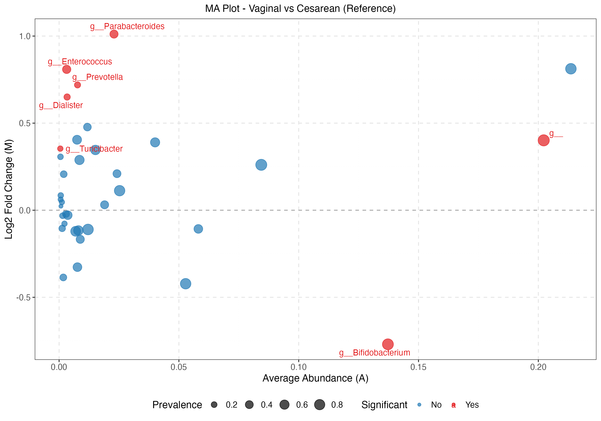

# Feature-level Analysis

A central task in feature-level analysis is to identify taxa with differential abundance between groups. The `generate_taxa_test_single` function performs differential abundance analysis (DAA) based on compositional data using the LinDA method, which is a DAA method based on log linear model with bias correction due to composiitonal effects.  If the data are not compositional, regular linear regression analysis will be used.

> Zhou H, He K, Chen J, Zhang X. LinDA: linear models for differential abundance analysis of microbiome compositional data. Genome Biol. 2022 Apr 14;23(1):95. doi: 10.1186/s13059-022-02655-5. PMID: 35421994; PMCID: PMC9012043.

In the `generate_taxa_test_single` function,  `feature.dat.type` parameter specifies the data type in the feature matrix.  Depending on the data type, different preprocessing steps and methods are used.

* `count` and `proportion`: For count and proportion data, which are both compositional, `linda` will be called. To address zeros, a pseudo-count of 0.5 is added to the count data, and zeros are substituted with half of the nonzero minimum for proportion data (feature-wise).  Winorization at 97% quantile is performed to reduce the influence of outliers.
* `other`:  When `feature.dat.type` is set to "other", the data are considered to be non-compositional and ordinary linear regression analysis will be performed. Users need to determine the appropriate normalization and transformation of the data before running the function.  This option increases the applicability of MicrobiomeStat to other data types.

The `prev.filter` and `abund.filter` parameters filter taxa based on their prevalence and average relative abundance, so those rare and less abundant taxa will be excluded from testing. As the statistical power for these rare/less abundant taxa tends to be low, excluding them can reduce multiple testing burden. 

The `feature.level` determines what aggregation level(s) the tests will be performed. If `feature.level` is set to "original", the original features in `feature.tab`  will be tested. The `feature.level` can also be set to the aggregated levels specified in the `feature.ann` matrix.

### Categorical vs Continuous Predictors

The `generate_taxa_test_single` function automatically distinguishes between categorical and continuous predictor variables:

* **Categorical variables** (factor/character): Creates pairwise comparisons vs. the reference level (first level of the factor). Output format: "Level vs Reference (Reference)" (e.g., "Treatment vs Control (Reference)")
* **Continuous variables** (numeric/integer): Tests linear association with a single slope coefficient. Output format: Variable name only (e.g., "age")

This distinction is important for interpreting results:
- For categorical variables, the coefficient represents the log2 fold change between groups
- For continuous variables, the coefficient represents the change in log2 abundance per unit increase in the predictor

The `generate_taxa_test_single` outputs a table of LinDA association statistics for all tested taxa/features. The table contains the following components:

* `Variable`: It identifies the taxon/feature being analyzed.
* `Coefficient`: Expressed as log2FoldChange for categorical variables, or slope for continuous variables, bias-corrected. It indicates the degree and direction of change in the abundance of a specific taxon/feature.
* `SE`: Standard errors of the coefficients. It measures the variability of the coefficient estimates.
* `Mean Abundance`: The average abundance of a particular taxon/feature across all samples.
* `Prevalence`: The proportion of samples where a specific taxon/feature is present.
  
`generate_taxa_volcano_single` will produce a volcano plot based on the `generate_taxa_test_single` output. It visualizes the relationship between the effect size (log foldchange) and its statistical significance. The function has the `feature.sig.level` and `feature.mt.method` parameters:
* `feature.sig.level`: This parameter determines the significance level, influencing the position of the dashed lines in the volcano plot. It sets the threshold for distinguishing between significant and non-significant differences.
* `feature.mt.method`: Thi parameter determines whether the fdr-adjusted p-values or raw p-values will be plotted . There are two options available currently: "fdr" (false discovery rate) and "none" (raw p-value). 

Following shows an example:

```r
# Load data
data(peerj32.obj)

# Generate taxa test
test.list <- generate_taxa_test_single(
    data.obj = peerj32.obj,
    time.var = "time",
    t.level = "2",
    group.var = "group",
    adj.vars = "sex",
    feature.dat.type = "count",
    feature.level = c("Phylum","Genus","Family"),
    prev.filter = 0.1,
    abund.filter = 0.0001
)
```

#### First 10 Rows of Differential Abundance Results at Genus Level

<table><thead><tr><th>Variable</th><th width="135">Coefficient</th><th width="54">SE</th><th>P.Value</th><th>Adjusted.P.Value</th><th>Mean.Abundance</th><th>Prevalence</th></tr></thead><tbody><tr><td>Actinomycetaceae</td><td>0.43088737</td><td>0.8125191</td><td>0.60204023</td><td>0.9892442</td><td>0.0001950405</td><td>0.7272727</td></tr><tr><td>Aerococcus</td><td>-0.09734179</td><td>0.7893169</td><td>0.90314569</td><td>0.9892442</td><td>0.0002352668</td><td>0.5909091</td></tr><tr><td>Aeromonas</td><td>0.02022775</td><td>1.0311377</td><td>0.98455351</td><td>0.9892442</td><td>0.0002829477</td><td>0.6363636</td></tr><tr><td>Akkermansia</td><td>-0.70914707</td><td>0.5667601</td><td>0.22603834</td><td>0.9892442</td><td>0.0202212889</td><td>1.0000000</td></tr><tr><td>Allistipes et rel.</td><td>-0.54628088</td><td>0.4985462</td><td>0.28688461</td><td>0.9892442</td><td>0.0083365762</td><td>1.0000000</td></tr><tr><td>Anaerofustis</td><td>0.37736758</td><td>0.3988262</td><td>0.35592789</td><td>0.9892442</td><td>0.0013725489</td><td>1.0000000</td></tr><tr><td>Anaerostipes caccae et rel.</td><td>-0.45297144</td><td>0.1723513</td><td>0.01655715</td><td>0.7004574</td><td>0.0185944926</td><td>1.0000000</td></tr><tr><td>Anaerotruncus colihominis et rel.</td><td>0.05420558</td><td>0.4605402</td><td>0.90754073</td><td>0.9892442</td><td>0.0028354658</td><td>1.0000000</td></tr><tr><td>Anaerovorax odorimutans et rel.</td><td>-0.55577241</td><td>0.3180729</td><td>0.09672749</td><td>0.9892442</td><td>0.0044828621</td><td>1.0000000</td></tr><tr><td>Aneurinibacillus</td><td>-0.20493605</td><td>0.5227462</td><td>0.69939327</td><td>0.9892442</td><td>0.0007296989</td><td>0.9545455</td></tr></tbody></table>

```r
# Generate volcano plots
volcano_plots <- generate_taxa_volcano_single(
    data.obj = peerj32.obj,
    group.var = "group",
    test.list = test.list,
    feature.sig.level = 0.1,
    feature.mt.method = "none"
)
```

<figure><figcaption></figcaption></figure>


Next, we will introduce functions to plot the taxa/features data. They can be used to visualize specific taxa/features, for example, those selected from differential abundance anlysis. Or they can be used to visualize all taxa with some basic filtering. The first function is `generate_taxa_boxplot_single`, which generate boxplots of abundance data. It has the following relevant parameters:
* `feature.dat.type`: One of "count", "proportion" or "other".  For "count", the data will be converted to proportion data before the visualization. 
* `transform`: This parameter indicates the transformation to apply to the abundance data when plotting. Transformations are only applied when the `feature.dat.type` is set to either "count" or "proportion".  When  `feature.dat.type` is "other",  no transformation will be performed. User should deterimne the appropriate transformation to better visualize the data. The available options for `transform` include:
  * `"identity"`: No transformation (default)
  * `"sqrt"`: Square root transformation
  * `"log"`: Logarithmic transformation. Zeros are replaced with half of the non-zero minimum  for each taxon before log transformation.
* `feature.level`: Specifiy which level of the data to be plotted. Same meaning as in  `generate_taxa_test_single`.
* `features.plot`: This parameter can be used in all feature-level visualization functions to specify which taxa or features should be visualized. This is particularly useful for focusing on the results of differential abundance analyses. When you provide a vector of taxa or feature names to `features.plot`, this will directly select these features for visualization, overriding any settings in `prev.filter` and `abund.filter`. By using this parameter, you can directly highlight and examine the taxa or features that are significantly different in abundance across your comparisons.
* `top.k.plot` and `top.k.func`: In many scenarios, especially when navigating through expansive datasets, you may want to focus on a select subset of taxa that stand out either due to their high abundance or  large variability. `top.k.plot` lets you visualize the top k taxa/features based on the criterion you selected in  `top.k.func`, which have four choices:
  * `"mean"`: Highlights taxa with the highest average abundances across samples.
  * `"sd"`: Selects taxa with the greatest variability (standard deviation) across samples, useful for identifying taxa with notable differences under varying conditions.
  * `"prevalence"`: Chooses taxa with the highest occurrence across samples, targeting those most consistently present.
  * `top.k.func` can also accept a user-defined function so that the users can rank taxa based on their own criterion.  The user-defined function should take the abundance matrix (those in `feature.tab` and `feature.agg.list`) as the input and returns a numeric vector of the feature importance values. This allows for criteria beyond "mean", "sd", or "prevalence".

  Certainly. Here's the revised content in English, maintaining consistency with the context and using more professional and concise language:

After performing differential abundance analysis with `generate_taxa_test_single` and visualizing results with `generate_taxa_volcano_single`, we can further explore phylogenetic relationships and abundance patterns using the `generate_taxa_cladogram_single` function. This function creates a circular cladogram with an integrated heatmap.

Key features of `generate_taxa_cladogram_single`:

1. Visualization of phylogenetic relationships
2. Integrated heatmap of abundance or coefficient data
3. Simultaneous visualization of multiple taxonomic levels
4. Filtering based on statistical significance
5. Customizable color-coding of cladogram branches by taxonomic level

Example usage:

```r
plot.list <- generate_taxa_cladogram_single(
  data.obj = peerj32.obj,
  test.list = test.list,
  group.var = "group",
  feature.level = c("Phylum","Genus","Family"),
  feature.mt.method = "none",
  cutoff = 0.9,
  color.group.level = "Family"
)
```

Key parameters:
- `color.group.level`: Taxonomic level for branch color-coding

The function returns a list of ggplot objects, one for each comparison in the data. These plots provide a holistic view of the microbiome data, combining phylogenetic information, abundance patterns, and statistical significance.

<figure><figcaption></figcaption></figure>

The following shows the usage and output of the function `generate_taxa_boxplot_single`. All the taxa are plotted together.

```r
generate_taxa_boxplot_single(
  data.obj = peerj32.obj,
  time.var = "time",
  t.level = "1",
  group.var = "group",
  strata.var = NULL,
  feature.level = c("Family"),
  feature.dat.type = "count",
  features.plot = NULL,
  top.k.plot = 8,
  top.k.func = "mean",
  transform = "log",
  prev.filter = 0,
  abund.filter = 0,
  base.size = 16,
  theme.choice = "bw",
  custom.theme = NULL,
  palette = NULL,
  pdf = TRUE,
  file.ann = NULL,
  pdf.wid = 11,
  pdf.hei = 8.5
)
```

<figure><figcaption></figcaption></figure>

For more clarity, `generate_taxa_indiv_boxplot_single` provides separate plots for each taxon. When the `pdf` parameter is set to `TRUE`, you can find the file in your default directory. Each page of this file represents a boxplot for a specific taxon or feature.

```r
generate_taxa_indiv_boxplot_single(
  data.obj = peerj32.obj,
  time.var = "time",
  t.level = "1",
  group.var = "group",
  strata.var = "sex",
  feature.level = c("Family"),
  features.plot = NULL,
  feature.dat.type = "count",
  top.k.plot = NULL,
  top.k.func = NULL,
  transform = "log",
  prev.filter = 0,
  abund.filter = 0,
  base.size = 20,
  theme.choice = "bw",
  custom.theme = NULL,
  palette = NULL,
  pdf = TRUE,
  file.ann = NULL,
  pdf.wid = 11,
  pdf.hei = 8.5
)
```

<figure><figcaption></figcaption></figure>

Besides boxplots, MicrobiomeStat can also generate heatmaps using the `generate_taxa_heatmap_single` function.  Heatmaps are particularly insightful for discerning clusters of taxa/features that exhibit similar abundance profiles across amples. By default, the function will only cluster rows (taxa/features) based on their abundance patterns. The columns are ordered by `group.var` and `strata.var`. If users wish to see the taxa in their original order without clustering, they can achieve this by setting `cluster.rows = FALSE`.  The function also allows for column clustering by setting `cluster.cols = TRUE`, which can be instrumental in revealing groups of samples with similar abundance profiles. Note that when `feature.dat.type` is "count” or "proportion", the data will be visualized using proportions. For "other" type, the original scale will be used. Following is an example:

```r
generate_taxa_heatmap_single(
  data.obj = peerj32.obj,
  time.var = NULL,
  t.level = NULL,
  group.var = "group",
  strata.var = "sex",
  feature.level = c("Family"),
  feature.dat.type = "count",
  features.plot = NULL,
  top.k.plot = NULL,
  top.k.func = NULL,
  prev.filter = 0.1,
  abund.filter = 0.1,
  base.size = 10,
  palette = NULL,
  pdf = TRUE,
  file.ann = NULL,
  pdf.wid = 11,
  pdf.hei = 8.5
)
```

<figure><figcaption></figcaption></figure>

We can use `generate_taxa_dotplot_single` function as an alternative to the heatmap. Here is the example:

```r
generate_taxa_dotplot_single(
  data.obj = peerj32.obj,
  time.var = NULL,
  t.level = NULL,
  group.var = "group",
  strata.var = "sex",
  feature.level = c("Family"),
  feature.dat.type = "count",
  features.plot = NULL,
  top.k.plot = NULL,
  top.k.func = NULL,
  prev.filter = 0.1,
  abund.filter = 0.001,
  base.size = 16,
  theme.choice = "bw",
  custom.theme = NULL,
  palette = NULL,
  pdf = TRUE,
  file.ann = NULL,
  pdf.wid = 15,
  pdf.hei = 8.5
)
```

<figure><figcaption></figcaption></figure>

We can use `generate_taxa_barplot_single` function to generate starked bar plots of taxa. The function has an important parameter `feature.number`.

* `feature.number`: This parameter determines the maximum number of taxa/features that will be visualized directly in the barplot. For datasets with numerous features, it's practical to limit to the most abundant or significant taxa, ensuring that the visualization remains informative and isn't cluttered. When the number of taxa surpasses the value defined in `feature.number`, the function aggregates low-abundance taxa into a collective category labeled "other". This means, for instance, if there are over 20 features in the dataset but `feature.number` is set to 20, the least abundant features that exceed this count will be collectively presented as "other" in the visualization. This approach ensures that the chart remains legible, highlighting the most dominant features, while still accounting for the contributions of less abundant taxa.

With this insight, let's now examine the function and the resultant visuals:

```r
generate_taxa_barplot_single(
  data.obj = peerj32.obj,
  time.var = NULL,
  t.level = NULL,
  group.var = "group",
  strata.var = "sex",
  feature.level = "Family",
  feature.dat.type = "count",
  feature.number = 30,
  base.size = 10,
  theme.choice = "bw",
  custom.theme = NULL,
  palette = NULL,
  pdf = TRUE,
  file.ann = NULL,
  pdf.wid = 11,
  pdf.hei = 8.5
)
```

<figure><figcaption></figcaption></figure>

<figure><figcaption></figcaption></figure>

### Visualizing Differential Abundance with MA Plots

The MA plot is a powerful visualization tool for differential abundance analysis, commonly used in genomics and now available for microbiome data through MicrobiomeStat. The `generate_taxa_ma_plot_single` function creates MA plots that visualize the relationship between average abundance (A) and log2 fold change (M) for each taxon, helping researchers identify features with significant abundance differences between groups.

In an MA plot:
- The x-axis (A) represents the average abundance of each taxon across all samples
- The y-axis (M) represents the log2 fold change between comparison groups
- Points are colored based on statistical significance
- Point size can represent prevalence or other metrics
- Significant taxa are typically labeled for easy identification

MA plots are particularly useful because they:
1. Show both effect size (fold change) and abundance information in one plot
2. Help identify abundance-dependent biases in differential testing
3. Allow visualization of overall patterns in the data (e.g., whether most changes are increases or decreases)
4. Complement volcano plots by emphasizing the abundance dimension

#### Using the `generate_taxa_ma_plot_single` function

The `generate_taxa_ma_plot_single` function takes the output from `generate_taxa_test_single` and creates MA plots for the differential abundance results:

```r
# First perform differential abundance testing
test.list <- generate_taxa_test_single(
  data.obj = peerj32.obj,
  group.var = "group",
  adj.vars = NULL,
  feature.level = c("Genus", "Family"),
  feature.dat.type = "count"
)

# Then create MA plots
plot.list <- generate_taxa_ma_plot_single(
  data.obj = peerj32.obj,
  group.var = "group",
  test.list = test.list,
  feature.sig.level = 0.05,
  feature.mt.method = "fdr"
)

# View the plot for Genus level
plot.list$Genus[[1]]
```

#### Key parameters for `generate_taxa_ma_plot_single`

- `data.obj`: The MicrobiomeStat data object
- `group.var`: The grouping variable used in the differential testing
- `test.list`: The output from `generate_taxa_test_single`, containing test results
- `feature.sig.level`: Significance level cutoff for highlighting taxa (default is 0.05)
- `feature.mt.method`: Multiple testing correction method, either "fdr" (default) or "none"
- `features.plot`: Optional. Specific taxa to include in the plots
- `palette`: Optional. Color palette for the plot
- `pdf`: Whether to save the plot as a PDF file
- `pdf.wid` and `pdf.hei`: Width and height of the PDF file if saved

#### Example MA plot interpretation

<figure><figcaption>Example MA plot showing differential abundance of genera between groups</figcaption></figure>

In the MA plot above:
- Each point represents a taxon (genus in this example)
- Taxa above the horizontal line (y=0) are more abundant in the comparison group
- Taxa below the line are less abundant in the comparison group
- Points in red are statistically significant at the specified threshold
- Larger points indicate taxa with higher prevalence across samples
- Text labels identify significant taxa to focus on for biological interpretation

MA plots complement volcano plots by emphasizing the relationship between abundance and fold change, which can reveal important patterns that might be missed when looking at just statistical significance. For example, you might observe that most significant changes occur in low-abundance or high-abundance taxa, which could inform further biological interpretation or methodological considerations.

---

## Advanced: Tree-Guided Differential Abundance with `linda2()`

MicrobiomeStat v1.4.2+ includes `linda2()`, an enhanced version of LinDA that supports **phylogenetic tree-guided smoothing** for improved statistical power. This method borrows strength from evolutionarily related taxa to boost detection of differentially abundant features.

### When to Use `linda2()`

- When you have a **phylogenetic tree** available (e.g., from 16S rRNA or shotgun metagenomic data)
- When you want to **increase statistical power** for detecting differentially abundant taxa
- When you expect **phylogenetically clustered effects** (related taxa responding similarly to treatment)

### Key Parameters for Tree-Guided Smoothing

```r
linda2(
  feature.dat,           # Feature abundance matrix
  meta.dat,              # Sample metadata
  formula,               # Model formula (e.g., "~ group + age")
  feature.dat.type,      # "count", "proportion", or "other"
  tree = NULL,           # Phylogenetic tree (phylo object)
  tree.smooth = FALSE,   # Enable tree-guided smoothing
  tree.lambda = 0.1,     # Smoothing strength (0.05-0.2 recommended)
  tree.k = 5,            # Number of nearest neighbors for local smoothing
  tree.meff.exponent = 2.2  # M_eff correction exponent
)
```

### Tree Smoothing Parameters Explained

* `tree.lambda`: Controls smoothing strength. Higher values = more borrowing from neighbors.
  - Default: 0.1 (mild smoothing)
  - Range: 0.05-0.2 recommended
  - Use lower values (0.05) for exploratory analysis
  - Use higher values (0.2) when strong phylogenetic clustering is expected

* `tree.k`: Number of nearest phylogenetic neighbors for local smoothing.
  - Default: 5
  - Lower values prevent signal leakage to distant taxa

* `tree.meff.exponent`: Exponent for effective number of tests correction.
  - Default: 2.2 (for N ≤ 100 samples per group)
  - Use 3.5 for larger sample sizes (N > 100)
  - This ensures proper FDR control after smoothing

### Example: Tree-Guided Analysis with phyloseq Data

```r
library(phyloseq)
library(MicrobiomeStat)

# If you have a phyloseq object with a tree
data("GlobalPatterns")
GP <- GlobalPatterns

# Subset to two groups for comparison
sample_data(GP)$Environment <- ifelse(
  sample_data(GP)$SampleType %in% c("Feces", "Skin", "Tongue"),
  "Human", "Environmental"
)

# Run linda2 with tree-guided smoothing
result <- linda2(
  phyloseq.obj = GP,
  formula = "~ Environment",
  tree.smooth = TRUE,      # Enable tree smoothing
  tree.lambda = 0.1,       # Mild smoothing
  verbose = TRUE
)

# The tree is automatically extracted from the phyloseq object
# Results include both smoothed p-values and M_eff correction
```

### Precision-Weighted Bias Correction

`linda2()` also includes an improved bias correction method that weights taxa by their precision (1/SE²). This reduces bias estimation error by up to 84% when taxa have heterogeneous standard errors (which is common in microbiome data where high-abundance taxa have lower variance).

This feature is automatically enabled when:
- SE ratio (max/min) is less than 100
- All SE values are finite and positive

### Output Interpretation

The output from `linda2()` is similar to `linda()`, with additional tree smoothing information:

```r
# Access results for a specific variable
result$output$EnvironmentHuman

# Columns include:
# - log2FoldChange: Bias-corrected effect size
# - lfcSE: Standard error
# - pvalue: Raw p-value (after smoothing if enabled)
# - padj: FDR-adjusted p-value (with M_eff correction if tree smoothing enabled)
```

### When Tree Smoothing Helps Most

Tree-guided smoothing provides the greatest power improvement when:
1. **True effects are phylogenetically clustered**: Related taxa respond similarly
2. **Sample size is limited**: Borrowing strength helps overcome noise
3. **Effect sizes are moderate**: Very large effects are detected anyway

For hypothesis-generating analyses, tree smoothing can reveal patterns that would be missed by taxon-by-taxon testing.
