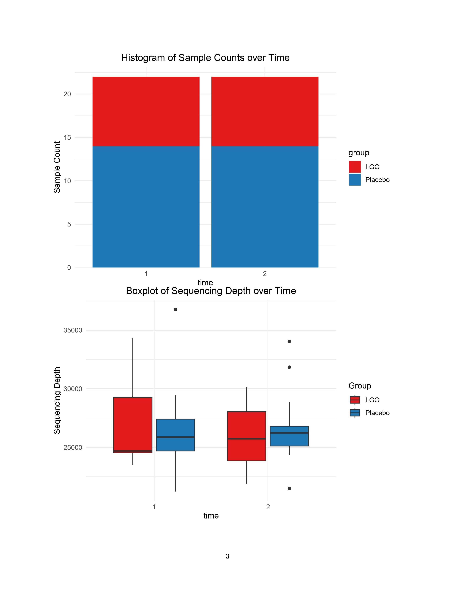
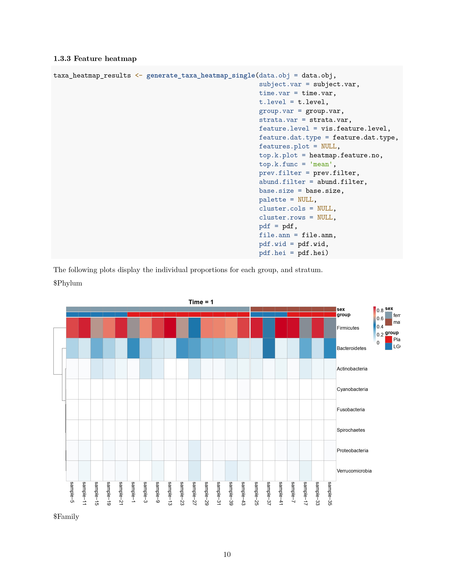
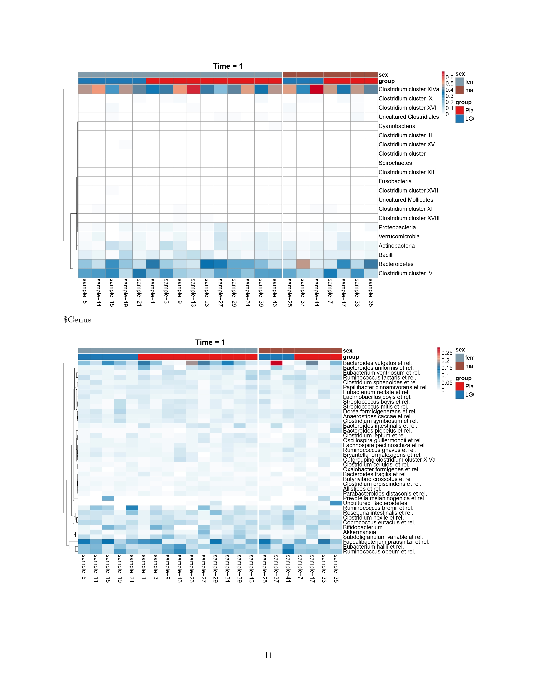
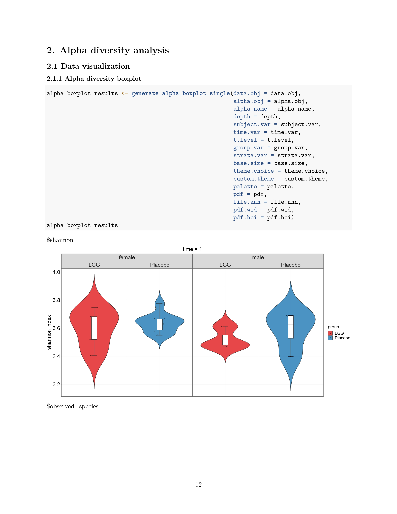
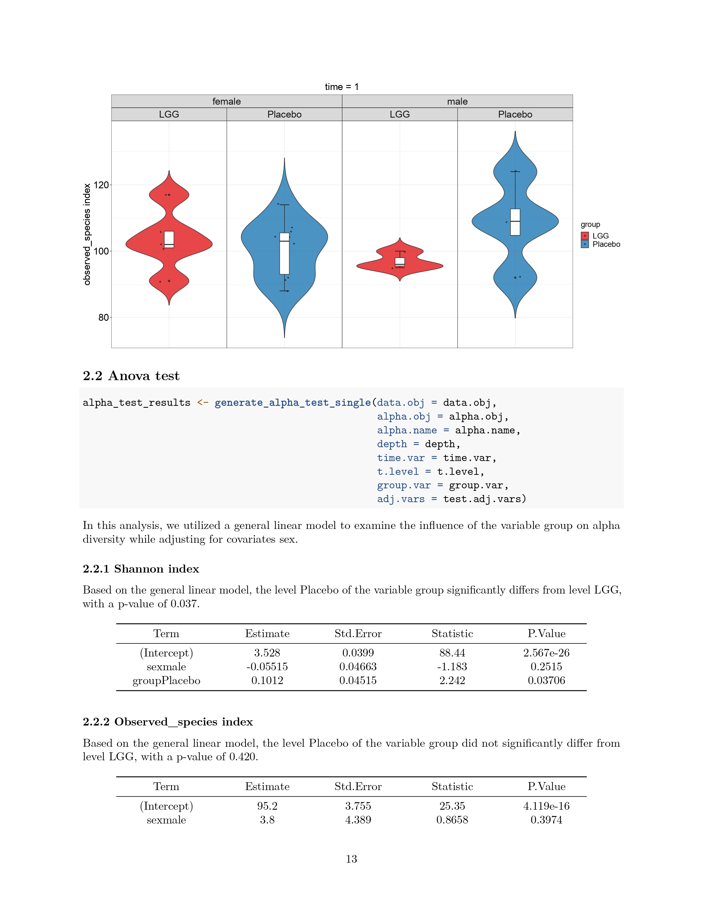
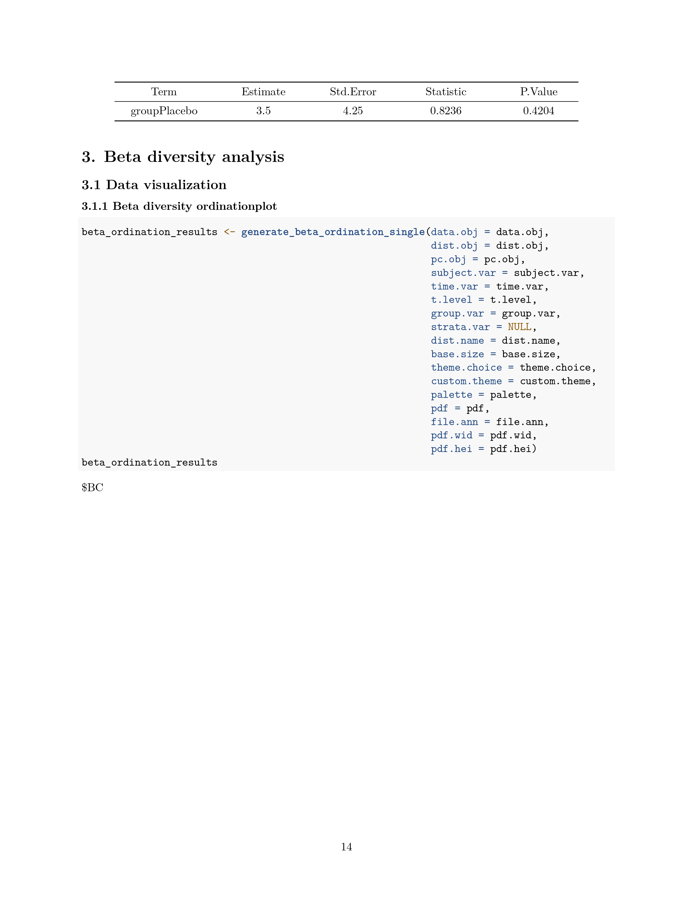
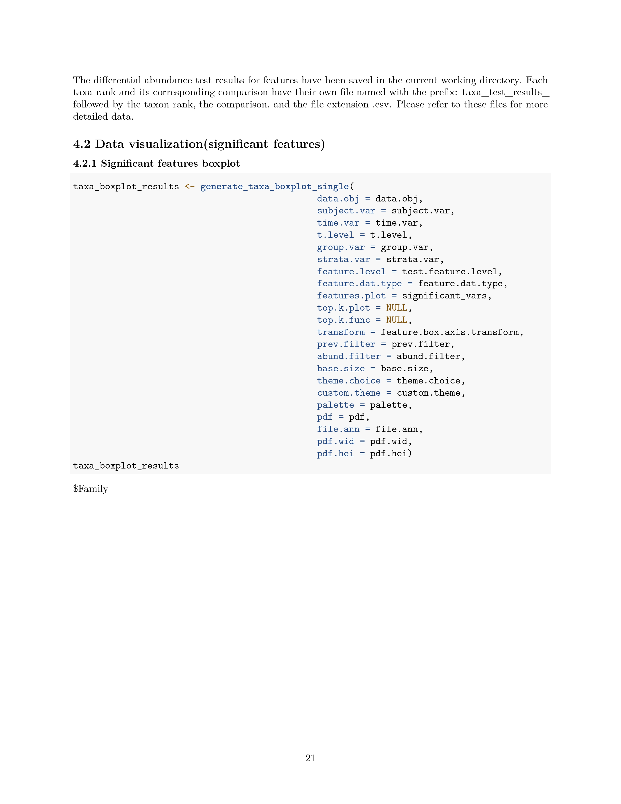

# Reports Generation


MicrobiomeStat equips researchers with automated workflows to quickly analyze the data and report the major findings by providing a one-click report-generation function. The standardized report integrates multidimensional perspectives, including alpha diversity, beta diversity, and differential abundance analysis, for comprehensive insights. The report contains both visualizations and statistical summaries to aid in biological interpretation and facilitate result dissemination. By automating time-consuming manual analytical tasks, MicrobiomeStat enables rapid, reproducible, and robust reporting to advance microbiome research.

The `mStat_generate_report_single()` function generates an integrated report for cross-sectional (single time point) analysis. It performs:

* **Alpha diversity analysis**: This calls functions `mStat_calculate_alpha_diversity()`, `generate_alpha_boxplot_single()`, and `generate_alpha_test_single()`.
* **Beta diversity analysis**: This calls functions  `mStat_calculate_beta_diversity()`, `generate_beta_ordination_single()`, and `generate_beta_test_single()`.
* **Feature-level analysis**: This calls functions `generate_taxa_barplot_single()`, `generate_taxa_dotplot_single()`, `generate_taxa_heatmap_single()`, `generate_taxa_test_single()` and `generate_taxa_volcano_single()`.

The function then compiles these analyses into a comprehensive PDF report. The report includes:

* A data summary from `mStat_summarize_data_obj()`
* Visual representations including alpha diversity boxplots, beta diversity ordination plots, and taxa composition visualizations
* Tables detailing statistical test results
* Commentary on key findings

Before using the function, it is important to understand the parameters:

* `data.obj`: A list object in MicrobiomeStat data format, which includes components feature.tab (matrix), feature.ann (matrix), meta.dat (data.frame), tree, and feature.agg.list (list). This object can be converted from other formats using several functions from the MicrobiomeStat package, or constructed manually. For more detailed information on how to convert data from other formats or how to construct the `data.obj` manually, please refer to the following page.


[laying-the-foundation-creating-the-microbiomestat-data-object](../setting-up-microbiomestat-installation-and-data-preparation/laying-the-foundation-creating-the-microbiomestat-data-object/)


* Once the data object has been successfully constructed, users may wish to perform some preprocessing of the data, including sample-level and feature-level filtering,  renaming and recoding of the variables, changing the data types of the variables (e.g., character to numeric, character to factor, etc.) and rearranging the levels for a factor variable (so the reference category appears as the first level). These preprocessing will make sure the analyses proceed smoothly.  We refer users to the following document for data manupilation.


[data-filtering.md](../data-manipulation-and-transformation/data-filtering.md)


* `group.var`: The name of the variable of primary interest. We currently support categorical type but plan to support numeric type in future versions.  For a continuous variable, the user could dichotomize their variable for the exploratory purpose.
* `test.adj.vars`: Names of columns in the metadata containing covariates to be adjusted for in statistical tests and models. Default is NULL, which indicates no covariates are adjusted for in statistical testing.
* `vis.adj.vars`: For alpha and beta diversity visualization functions, the `vis.adj.vars` parameter specifies the covariates whose effects will be removed before visualization. This is achieved by taking reisuals after regressing the alpha diversity and beta diversity PCs on the variables specified by `vis.adj.vars`. This step is important to reveal the signal of interest when the unwanted variation in `vis.adj.vars` dominates/obscures the signals.  Although it is equally important to do similar adjustment to feature-level data, due to the complexity of the data characteristics (zero inflation, etc.), such linear model-based adjustment may not be sufficient. 
* `strata.var`: Variable to stratify the data in visualization.
* `subject.var`: Variable name used for subject identification.
* `time.var`: Variable name used for time points.
* `t.level`: Character string specifying the time level/value to subset the data to, only if both `time.var` and `t.level` are specified. If NULL, all data will be used. 
* `alpha.obj`: A matrix containing pre-calculated alpha diversity measures (row - samples, column - measures). If NULL (default), alpha diversity measures will be calculated using `mStat_calculate_alpha_diversity` function after data rarefaction by `mStat_rarefy_data`. The rarefaction depth can be specified with `depth` parameter or minimum depth will be used if `depth = NULL`.
* `alpha.name`: The alpha diversity measures to be used. Supported measures include "shannon", "simpson", "observed\_species", "chao1", "ace", and "pielou". If  this parameter is set to NULL, the report will not include any alpha diversity results. 
* `depth`: An integer. Rarefaction depth when rarefaction is needed. If NULL, the minimum sequencing depth will be used.
* `dist.name`: A character vector specifying which beta diversity measures to calculate. Supported measures are "BC" (Bray-Curtis), "Jaccard", "UniFrac" (unweighted UniFrac), "GUniFrac" (generalized UniFrac), "WUniFrac" (weighted UniFrac), and "JS" (Jensen-Shannon divergence). If  this parameter is set to NULL, the report will not include any beta diversity results. 
* `dist.obj`: A list of distance matrices between samples. If NULL, beta diversity distance matrices will be automatically computed from `data.obj` using `mStat_calculate_beta_diversity` after data rarefaction.
* `pc.obj`: A list containing the principal coordinates calculated on the beta diversity distance matrices. If NULL (default), dimension reduction will be automatically performed using metric multidimensional scaling (MDS) via `mStat_calculate_PC`. The `pc.obj` list structure should contain:
  * `$points`: A matrix with samples as rows and PCs as columns containing the coordinates.
  * `$eig`: Eigenvalues for each PC dimension.
  * `$vectors`: Feature loadings vectors for each PC.
  * Other metadata like `$method`, `$dist.name`, etc. See `mStat_calculate_PC` function for details.
* `feature.dat.type`: The type of the feature data, which determines how the data is handled in downstream analyses. Should be one of: "count": Raw count data from a sequencing experiment (e.g. ASV/OTU count); "proportion": Data that has already been normalized to proportions/percentages (e.g., functional data); "other": Other non-compositional data types, where the data will be analyzed directly without normalization and transformation. The user needs to determine the data-specific QC, normalization, and transformation. If the user wants to normalize/transform the abundance data on his own way, he can also use this option.
* `feature.analysis.rarafy`: Logical, indicating whether to rarefy the data for feature-level analysis. If TRUE, the feature data will be rarefied before visualization and analysis. Default is TRUE. Note: When the majority of the features are of low-abundance, their presence/absence strongly depends on the sequencing depth. Rarefaction can be used to remove the unwanted variation due to sequencing depth and could increase the power for the analysis of rare features. 
* `vis.feature.level`: The feature levels to be visualized for an overview of the data (stacked barplot, heatmap, etc.).  Feature levels should correspond to the column names in the feature annotation matrix (`feature.ann`) of data.obj. It could also contain the "original" level, which is the raw feature level without aggregation.
* `bar.area.feature.no`: A numeric value indicating the number of top abundant features to retain in both barplot and areaplot. Features with average relative abundance ranked below this number will be grouped into 'Other'. Default 20. Only applicable to count and proportion data.
* `heatmap.feature.no`: A numeric value indicating the number of top abundant features to retain in the heatmap. Features with average relative abundance ranked below this number will be grouped into 'Other'. Default 20.
* `dotplot.feature.no`: A numeric value indicating the number of top abundant features to retain in the dotplot. Features with average relative abundance ranked below this number will be grouped into 'Other'. Default 40. Only applicable to count and proportion data.
* `test.feature.level`: The feature levels to be tested. Similar to `vis.feature.level`. The signficant features will be visualized collectively and individually.
* `feature.mt.method`: Character, multiple testing method to identify differential features, "fdr" or "none". Default is "fdr".
* `feature.sig.level`: Numeric, significance cutoff for declaring differntial features, default is 0.1.
* `feature.box.axis.transform`: A string indicating the transformation to be applied to abundance data before plotting. This parameter is only used in `generate_taxa_boxplot_single` and `generate_taxa_indiv_boxplot_single`. Options are:
  * "identity": No transformation (default),
  * "sqrt": Square root transformation,
  * "log": Logarithmic transformation. 
* `base.size`: Base font size for the generated plots.
* `theme.choice`: Plot theme choice. Can be one of: "prism": ggprism::theme\_prism(), "classic": theme\_classic(), "gray": theme\_gray(), "bw": theme\_bw().
* `output.file`: A character string specifying the output file name for the report. Full path can be specified, e.g., "path_to_your_location/report". The file extension (.pdf or .html) will be automatically added based on the `output.format` if not already present. This parameter also determines the title of the generated report. For example, if set to "path_to_your_location/my_report", the report title will be "my_report".
* `output.format`: A character string specifying the desired output format of the report. Must be either "pdf" or "html". Default is c("pdf", "html"), which will use the first value ("pdf") if not explicitly specified. This parameter determines whether the report will be generated as a PDF or HTML document.

Note: Before running the function, please be aware of potential compatibility issues between RStudio and LaTeX. These issues can lead to problems such as images from the RStudio Viewer appearing in unexpected locations in the PDF report. To avoid this, it is recommended to clear the current images in the RStudio Viewer before running the function. You can do this by clicking on the broom icon in the RStudio Viewer.

Now, let's see how we can implement the function:

```r
# Load the dataset
data(peerj32.obj)
data.obj = peerj32.obj

# Specify variable names
group.var = "group" # Variable used for grouping samples, primary variable of interest
vis.adj.vars = c("sex") # Covariates whose effects need to be removed before visualization
test.adj.vars = c("sex") # Covariates whose effects need to be adjusted in statistical tests
subject.var = "subject" # Variable used for subject identification
time.var = "time" # Variable used for time points

# Specify diversity indices
alpha.name = c("shannon", "observed_species") # Alpha diversity indices to calculate
dist.name = c("BC",'Jaccard') # Beta diversity indices to calculate

# Specify feature levels for visualization and testing
vis.feature.level = c("Phylum", "Family", "Genus") # Feature levels for visualization to have an overview of the data
test.feature.level = "Family" # Feature level to use for testing

# Specify other parameters
feature.dat.type = "count" # Type of the feature data
theme.choice = "bw" # Theme choice for the plots
base.size = 20 # Base size for the plots

# Parameters for multiple testing. Following setting is just for illustration. In real data analysis, multiple testing correction should always be applied.  
feature.mt.method = "none" # Multiple testing method for differential feature analysis
feature.sig.level = 0.2 # Significance level cutoff for highlighting differential features 

# Specify output file
output.file = "path/to/mStat_generate_report_single_example.pdf" # Replace with your own file path for the output report

# Specify optional parameters
dist.obj = NULL # Replace with a pre-computed distance matrix if available
alpha.obj = NULL # Replace with a pre-computed alpha diversity matrix if available
depth = NULL # Replace with a desired rarefaction depth, if NULL, minimum depth will be used
t.level = "1" # Replace with a desired time level if time points have multiple levels
feature.box.axis.transform = "sqrt" # Axis transformation for feature boxplots
strata.var = "sex" # Variable to stratify on in visualization

# Specify parameters for feature retention
bar.area.feature.no = 20 # Number of top abundant features to retain in barplot and areaplot
heatmap.feature.no = 20 # Number of top abundant features to retain in heatmap
dotplot.feature.no = 40 # Number of top abundant features to retain in dotplot

# Run the function
mStat_generate_report_single(
   data.obj = data.obj,
   dist.obj = dist.obj,
   alpha.obj = alpha.obj,
   group.var = group.var,
   vis.adj.vars = vis.adj.vars,
   test.adj.vars = test.adj.vars,
   subject.var = subject.var,
   time.var = time.var,
   alpha.name = alpha.name,
   depth = depth,
   dist.name = dist.name,
   t.level = t.level,
   feature.box.axis.transform = feature.box.axis.transform,
   strata.var = strata.var,
   vis.feature.level = vis.feature.level,
   test.feature.level = test.feature.level,
   feature.dat.type = feature.dat.type,
   bar.area.feature.no = bar.area.feature.no,
   heatmap.feature.no = heatmap.feature.no,
   dotplot.feature.no = dotplot.feature.no,
   feature.mt.method = feature.mt.method,
   feature.sig.level = feature.sig.level,
   theme.choice = theme.choice,
   base.size = base.size,
   output.file = output.file
 )
```

<figure><figcaption></figcaption></figure>

<figure><figcaption></figcaption></figure>

<figure><figcaption></figcaption></figure>

<figure><figcaption></figcaption></figure>

<figure><figcaption></figcaption></figure>

<figure><figcaption></figcaption></figure>

<figure><figcaption></figcaption></figure>

<figure><figcaption></figcaption></figure>

<figure><figcaption></figcaption></figure>

<figure><figcaption></figcaption></figure>

<figure><figcaption></figcaption></figure>

<figure><figcaption></figcaption></figure>

<figure><figcaption></figcaption></figure>

<figure><figcaption></figcaption></figure>

<figure><figcaption></figcaption></figure>

<figure><figcaption></figcaption></figure>

<figure><figcaption></figcaption></figure>

<figure><figcaption></figcaption></figure>

<figure><figcaption></figcaption></figure>

<figure><figcaption></figcaption></figure>

<figure><figcaption></figcaption></figure>

<figure><figcaption></figcaption></figure>

<figure><figcaption></figcaption></figure>



The automated report reduces the need for manual interaction and ensures consistency. 


